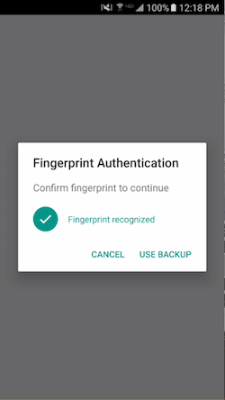
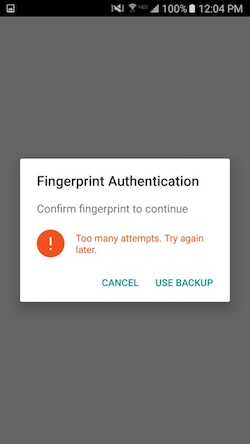
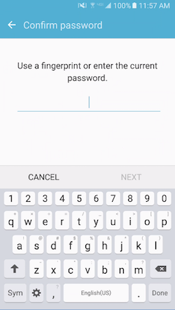
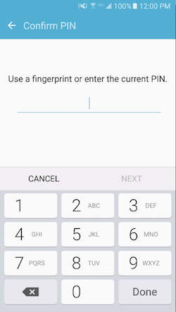
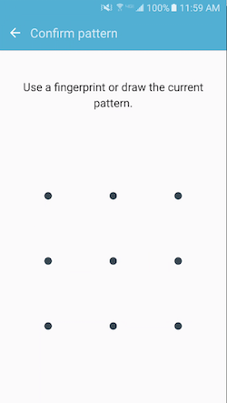

#About
This plugin was created referencing the [Fingerprint Dialog sample](http://developer.android.com/samples/FingerprintDialog/index.html) and the [Confirm Credential sample](http://developer.android.com/samples/ConfirmCredential/index.html) referenced by the [Android 6.0 APIs webpage](http://developer.android.com/about/versions/marshmallow/android-6.0.html).

This plugin will open a native dialog fragment prompting the user to authenticate using their fingerprint.  If the device has a secure lockscreen (pattern, PIN, or password), the user may opt to authenticate using that method as a backup.

#Screenshots
###Fingerprint Auth Dialog
 |  |  |  |  | 
###Backup Credentials
 |  | 


#Installation
`meteor add cordova:cordova-plugin-android-fingerprint-auth`

#Setup
Add preference to mobile-config.js
```
App.setPreference('android-targetSdkVersion', '23');
```

set compile version and build tools in build.gradle
```
compileSdkVersion 23
buildToolsVersion "23.0.2"
```

#API
###FingerprintAuth.show(config, successCallback, errorCallbck)

Opens a native dialog fragment to use the device hardware fingerprint scanner to authenticate against fingerprints
registered for the device.

#### Config Object
| Param | Type | Default | Description |
| --- | --- | --- |
| clientId | String | undefined | (REQUIRED) Used as the alias for your key in the Android Key Store. |
| clientSecret | String | undefined | (REQUIRED) Used to encrypt the token returned upon successful fingerprint authentication. |
| disableBackup | boolean | false | Set to true to remove the "USE BACKUP" button |

**Example**  

```
FingerprintAuth.show({
            clientId: "myAppName",
            clientSecret: "a_very_secret_encryption_key"
        }, successCallback, errorCallback);

/**
 * @return {withFingerprint:base64EncodedString, withPassword:boolean}
 */
function successCallback(result) {
    console.log("successCallback(): " + JSON.stringify(result));
    if (result.withFingerprint) {
        console.log("Successfully authenticated using a fingerprint");
    } else if (result.withPassword) {
        console.log("Authenticated with backup password");
    }
}

function errorCallback(error) {
    console.log(error); // "Fingerprint authentication not available"
}

```

###FingerprintAuth.isAvailable(successCallback, errorCallback)

**Example**

```
FingerprintAuth.isAvailable(isAvailableSuccess, isAvailableError);

/**
 * @return {
 *      isAvailable:boolean,
 *      isHardwareDetected:boolean,
 *      hasEnrolledFingerprints:boolean
 *   }
 */
function isAvailableSuccess(result) {
    console.log("FingerprintAuth available: " + JSON.stringify(result));
    if (result.isAvailable) {
        FingerprintAuth.show({
                    clientId: "myAppName",
                    clientSecret: "a_very_secret_encryption_key"
                }, successCallback, errorCallback);
    }
}

function isAvailableError(message) {
    console.log("isAvailableError(): " + message);
}
```